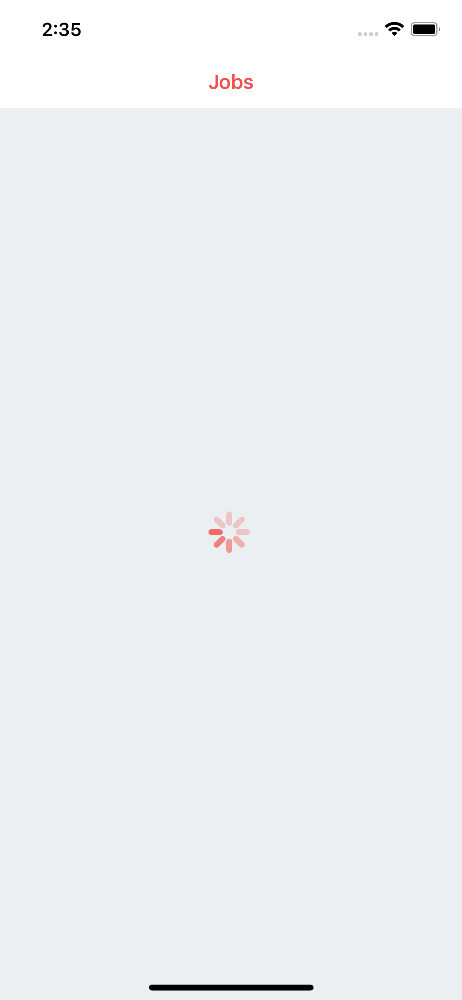
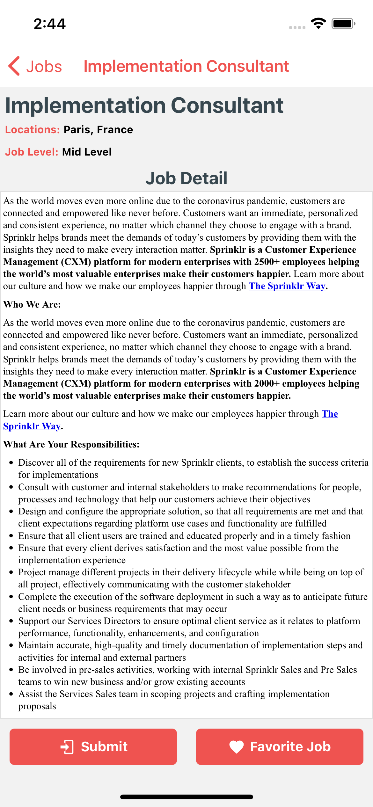
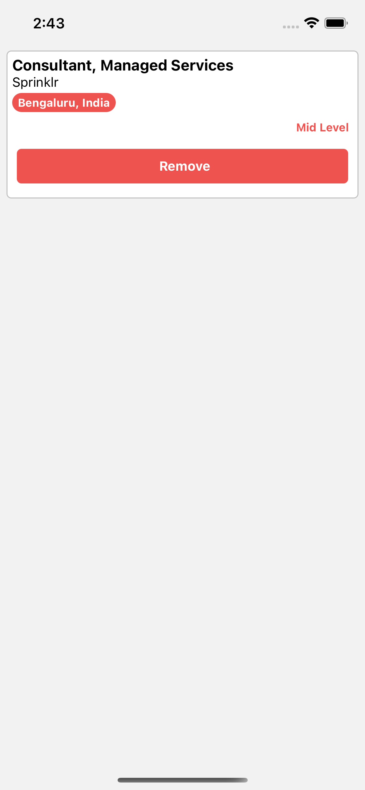

# Zeyrek Works
Bu uygulama [themuse.com](https://www.themuse.com/) sitesinden sağlanan veriler yardımı ile yapılmış bir iş ilanı uygulamasıdır. Uygulama geliştirilmeye oldukça açıktır. Şu anda v1 aşamasındadır.

## İçerik 
* Api yardımı ile alınan iş ilanlarının listelenmesi.
* Detay sayfasına giderek iş ilanında bulunan bilgilerin tamamına erişimin sağlanması.
* [react-native-webview](https://github.com/react-native-webview/react-native-webview) kütüphanesi ile beraber apiden gelen html bilgilerinin uygulama içerisinde gösterilmesi.
* Favorilere eklenmesini istediğimiz bir işi [Realm](https://www.mongodb.com/docs/realm/introduction/) veri tabanı sayesinde cihazın hafızasına kayıt ederek favoriler listesinin oluşturulması.
* Benzer bir sistem ile beraber işe başvurma işlemlerini de gerçekleştriebiliriz.

## Görseller

